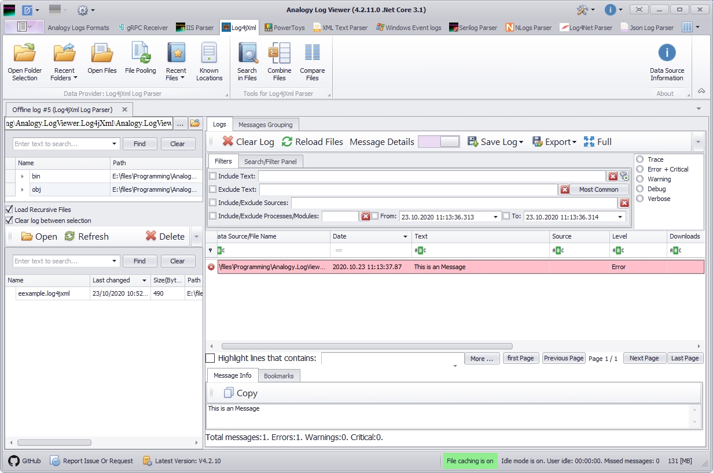

# Analogy.LogViewer.Log4jXml [](https://github.com/Analogy-LogViewer/Analogy.LogViewer.Log4jXml/actions/workflows/dotnet-core-desktop.yml)
Analogy Parser for Log4jXml layouts

This project is  on based on great project [Logazmic](https://github.com/ihtfw/Logazmic)

This is POC project.
For example:
log with 
```
<log4j:event logger="Statyk7.Another.Name.DummyManager" timestamp="1184286222308" level="ERROR" thread="1">
    <log4j:message>This is an Message</log4j:message>
    <log4j:properties>
        <log4j:data name="log4jmachinename" value="remserver" />
        <log4j:data name="log4net:HostName" value="remserver" />
        <log4j:data name="log4net:UserName" value="REMSERVER\Statyk7" />
        <log4j:data name="log4japp" value="Test.exe" />
    </log4j:properties>
</log4j:event>
```

will be parsed as:

